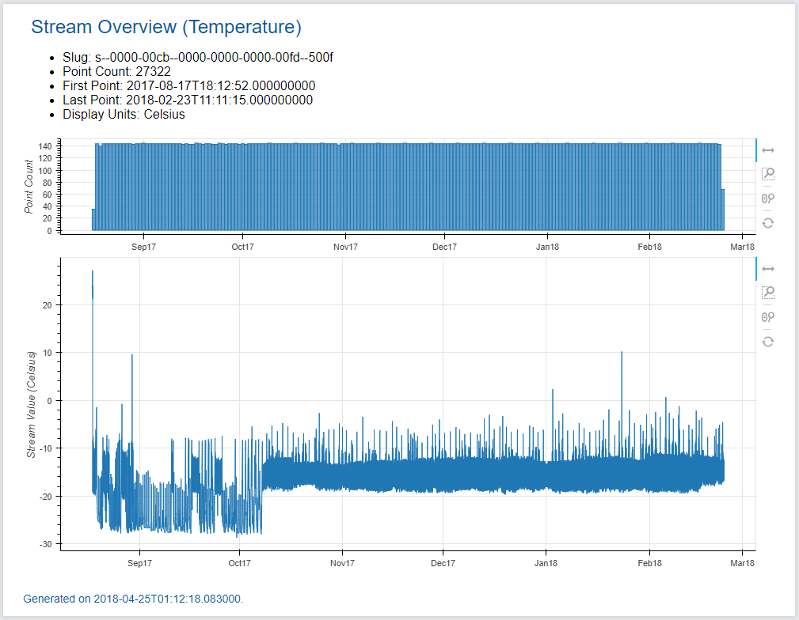

.. _quickstart-label:

5-Minute Quickstart Guide
=========================

Make sure you have everything installed and up to date before running any of the
examples below:

.. code-block:: bash
	
	pip install -U iotile-analytics-core iotile-analytics-interactive iotile-analytics-offline

..  note::

	In the following examples, all of the data referenced will be local to your
	computer.  You will be prompted to download some data files before each
	example so that you can quickly get up to speed with no external
	dependencies.

``iotile-analytics`` works on Python 2.7+ and Python 3.5+.  There is no usage difference
on Python 2 or Python 3.

Generating Live Reports
-----------------------

Live Reports are a key part of IOTile Analytics.  They are static HTML documents
that either embed data and plots or reference local data files that can be
accessed without needing a web server.

.. important::

	Download :download:`freezer.hdf5 <data/freezer.hdf5>` to use as source data and
	place it in your current working directory.

The quickest way to generate a live report is to use the `analytics-host` command
line program that comes with `iotile-analytics-interactive`.  You can use the 
program to generate reports from datasets that are either stored locally on your
computer or downloaded on the fly from iotile.cloud.

Almost always, the output of `analytics-host` is an interactive html+javascript
document embedding graphs, data tables and other widgets to let you scroll through
your data.  Sometimes the output is just plain text or a different binary format.

Python packages you have installed can register LiveReport types with
`analytics-host` so that you run them from the command line.  Let's see what
reports you have installed:

.. code:: bash

	$ analytics-host -l
	Installed Report Count: 3

	Known Reports:
	 - save_hdf5: Save all data locally as an HDF5 database file.
	 - stream_overview: Display histogram and time series information about a stream.
	 - basic_info: A basic LiveReport that just prints source information.

You have 3 reports installed.  You can download data from iotile.cloud for fast local 
access, you can print basic_info about a data source and you can create an interactive
html report about a data stream.

Let's look at the data source `freezer.hdf5` that you downloaded.

.. code:: bash

	$ analytics-host -t basic_info ./freezer.hdf5 -c
	Source Info
	-----------
	active                         1
	busy                           0
	claimed_by                     arch-example-user
	claimed_on                     2017-08-17T18:45:41Z
	created_on                     2017-01-11T03:39:14Z
	external_id
	gid                            0000-0000-0000-00fd
	id                             253
	label                          Freezer Temperature
	lat                            0.0
	lon                            0.0
	org                            arch-example-data
	project                        05612d90-afc5-47be-b6a6-304b26c56488
	sg                             single-temp-sensor-v1-1-0
	slug                           d--0000-0000-0000-00fd
	state                          N1
	template                       pod-1gg1-es1-v2-0-0

	Properties
	----------

Here we see that our downloaded data comes from a random device that is supposed to
measure temperature and was named 'Freezer Temperature'.  Note that we always pass the `-c`
parameter so that we don't have to confirm all of our actions.  Otherwise you will be
prompted before actually generating a report.

You can also see the data streams that the device has by giving an argument to the report.

.. code:: bash

	$ analytics-host -t basic_info ./freezer.hdf5 -c -a streams=true
	Source Info
	-----------
	active                         1
	busy                           0
	claimed_by                     arch-example-user
	claimed_on                     2017-08-17T18:45:41Z
	created_on                     2017-01-11T03:39:14Z
	external_id
	gid                            0000-0000-0000-00fd
	id                             253
	label                          Freezer Temperature
	lat                            0.0
	lon                            0.0
	org                            arch-example-data
	project                        05612d90-afc5-47be-b6a6-304b26c56488
	sg                             single-temp-sensor-v1-1-0
	slug                           d--0000-0000-0000-00fd
	state                          N1
	template                       pod-1gg1-es1-v2-0-0

	Properties
	----------

	Stream Summaries
	----------------
	System Data 5C00                         s--0000-00c8--0000-0000-0000-00fd--5c00
	System Data 5C01                         s--0000-00c8--0000-0000-0000-00fd--5c01
	System Data 5C02                         s--0000-00c8--0000-0000-0000-00fd--5c02
	System Data 5C03                         s--0000-00c8--0000-0000-0000-00fd--5c03
	Temperature                              s--0000-00cb--0000-0000-0000-00fd--500f
	System Data 5800                         s--0000-00cb--0000-0000-0000-00fd--5800
	System Data 5A05                         s--0000-00cb--0000-0000-0000-00fd--5a05
	System Data 5C00                         s--0000-00cb--0000-0000-0000-00fd--5c00
	System Data 5C01                         s--0000-00cb--0000-0000-0000-00fd--5c01
	System Data 5C02                         s--0000-00cb--0000-0000-0000-00fd--5c02
	System Data 5C04                         s--0000-00cb--0000-0000-0000-00fd--5c04
	System Data 5C05                         s--0000-00cb--0000-0000-0000-00fd--5c05

	Stream Counts
	-------------
	s--0000-00c8--0000-0000-0000-00fd--5c00                   2 points      0 events
	s--0000-00c8--0000-0000-0000-00fd--5c01                   3 points      0 events
	s--0000-00c8--0000-0000-0000-00fd--5c02                   2 points      0 events
	s--0000-00c8--0000-0000-0000-00fd--5c03                   1 points      0 events
	s--0000-00cb--0000-0000-0000-00fd--500f               27322 points      0 events
	s--0000-00cb--0000-0000-0000-00fd--5800                4585 points      0 events
	s--0000-00cb--0000-0000-0000-00fd--5a05                8516 points      0 events
	s--0000-00cb--0000-0000-0000-00fd--5c00                  41 points      0 events
	s--0000-00cb--0000-0000-0000-00fd--5c01                4425 points      0 events
	s--0000-00cb--0000-0000-0000-00fd--5c02                4422 points      0 events
	s--0000-00cb--0000-0000-0000-00fd--5c04                4585 points      0 events
	s--0000-00cb--0000-0000-0000-00fd--5c05                4585 points      0 events

This report tells us that we have a lot of system data available about this device
and just one user friendly temperature stream named `Temperature`.  Let's view the
temperature data.

.. code:: bash
	
	$ analytics-host -t stream_overview ./freezer.hdf5 -a stream=temp -c -o temperature -a units=Celsius
	Rendered report to: temperature.html

You should have a file in your local directory named `temperature.html`, which when you open in a browser
should look something like this:

.. important::
	
	Unlike the static image rendered in this documentation, the actual `temperature.html` file you produced
	is completely dynamic.  Use the tools next to each image to pan and zoom around the data, which shows
	two graphs of how often data came in (once per hour) and the actual room temperature over a 6 month
	period.  

Seeing Report Usage
-------------------

Each LiveReport that you can generate comes with built in documentation showing how you can use it and
what, if any arguments it accepts.  You can view the help documentation using `analytics-host -l -t <report_name>`

For example, let's see what arguments are allowed for the `stream_overview` report:

.. code:: bash

	$ analytics-host -l -t stream_overview
	Display histogram and time series information about a stream.

	This report generates two plots.  The first is a bar graph that shows how many data points were
	received in this stream every X hours/weeks/days etc.  This is particularly useful for diagnosing
	issue where data should be received regularly but is not.  It can also help you orient yourself
	when looking through a stream with data collected over widely separated time intervals like data
	for 2 months then a 3 month gap then 1 month of data, etc.

	The second plot is just a graph of the data in the stream over time.  You units of the graph are
	whatever the internal units of the stream are unless you override them by passing the name of your
	desired units as a parameter.  If you do choose to override the units, you must specify a units
	name that has a known conversion from the internal stream units.

	Parameters:
	 - units (str):
	   The desired units in which you want to see the data.  This must be defined as an available
	   output unit on the stream.  If not passed, the default is to use whatever the internal units
	   are of the stream.  You can see what output unit options are by passing a random string here
	   and looking at the error message.
	 - window (str):
	   The aggregation period for showing when there is data in a stream.  You can pass a value like
	   'days', 'hours', 'weeks', 'months'.  This will be given to TimeSelectViewer so any valid value
	   there is acceptable here.  Defaults to days.
	 - mdo (list(float)):
	   An optional MDO to use to convert the data stored in this stream.  If passed this must be 3
	   float values that define a linear transformation of the data stored in the stream. The values
	   are interpreted as a m / d * value + o where the argument is specified as [m, d, o].
	 - stream (str):
	   A unique identifier for the stream that we wish to download and display.  This can be anything
	   that could be passed to AnalysisGroup.fetch_stream including a 4-character variable ID, a
	   partial string that matches the label of the stream, etc.

There are two components of the help information for a LiveReport.  The first is just general information
about what to expect from this report.  The second are any parameters that you can pass in order to
adjust the report's output.  Not all reports have parameters and most parameters have sane defaults so it
is safe to not pass anything.

If you want to set a parameter you do it by passing an argument on the command line to ``analytics-host``
of ``-a <parameter_name>=<parameter_value>``.  The parameter is automatically parsed and converted to
the appropriate units as listed in the help text for the LiveReport.  For example, this report takes 
an optional custom linear transformation parameter named ``mdo`` that is specified to be a list of 
3 floating point numbers.  

You would pass that on the command line as a string such as ``-a mdo=[1.0,2.0,3.0]``.  If you need to
include a space in the parameter value, make sure to quote it so that the shell does not misinterpret
the value as another argument to the program.

Saving Data Offline
-------------------

Any LiveReport can be generated either directly from iotile.cloud by passing the ``slug`` of the device
or archive that you want to use.  A slug is an alphanumeric identifier that starts with ``d--`` for 
a device and ``b--`` for an archive.  

If you have data that you wish to download and save, you can use the ``save_hdf5`` report to cache all
data offline.

.. note::

	You will need to login with your iotile.cloud email address and password in order to download data
	from iotile.cloud and you can only access data that belongs to devices or archives that you have 
	access to.

For example, let's say you want to download data from device ``d--abcd-0000-5678-1234`` and save it to
a file named ``my-device.hdf5``  You would do:

.. code:: bash

	$ analytics-host -t save_hdf5 d--abcd-0000-5678-1234 -o my-device -c
	Please enter your IOTile.cloud email: user@your-email.com
	Please enter your IOTile.cloud password:
	Rendered report to: my-device.hdf5

See how the final line says ``Rendered report to: my-device.hdf5``.  That is the offline file that you
can use for any live report generation without needing internet access.
